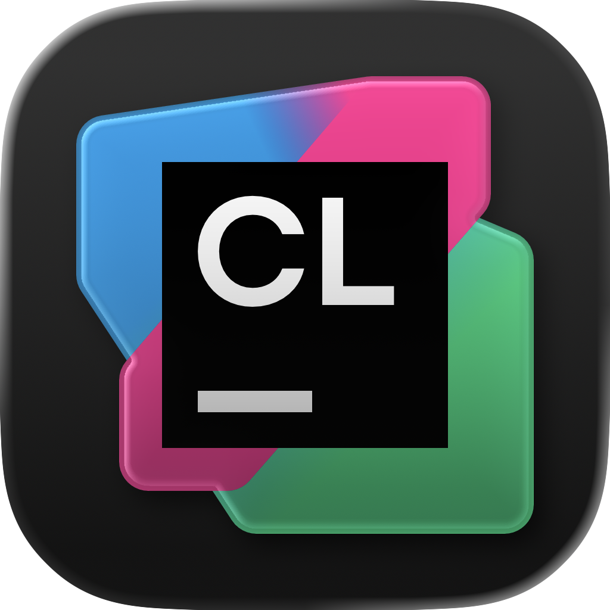
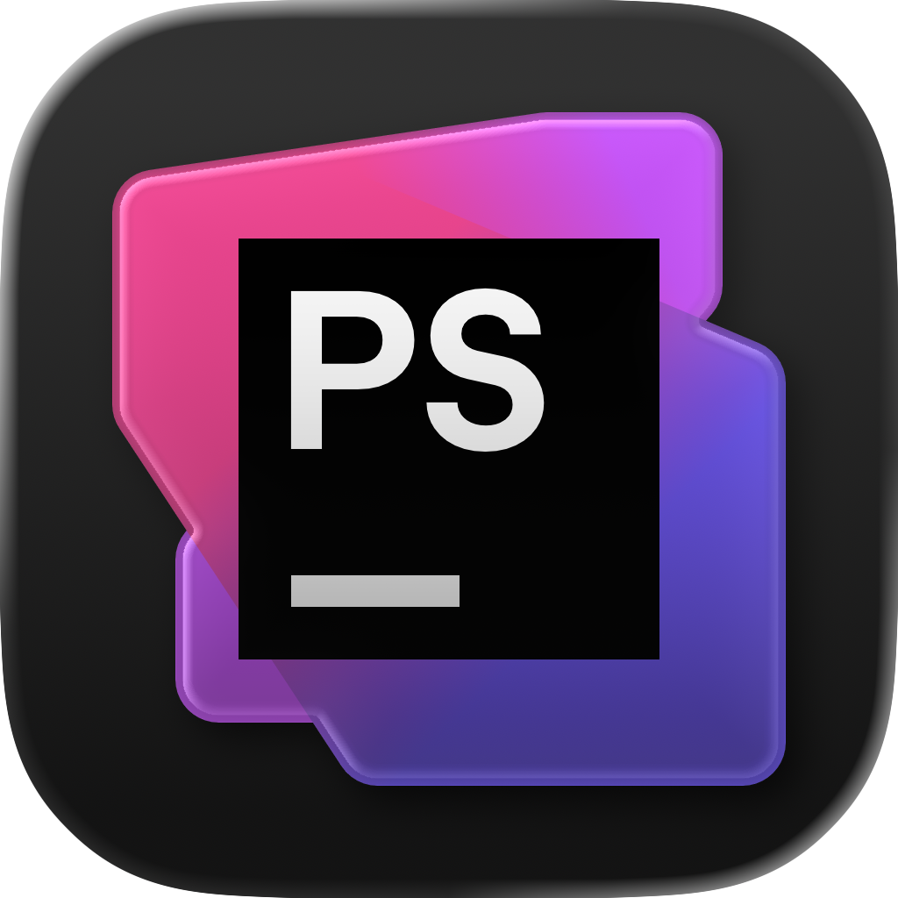

<div align="center">
  <p></p>
  <h1>NIGHTWYN</h1>
</div>

<table><tr><td align="center" width="9999"><p>
  <a href="https://olankens.com">WEBSITE</a> ·
  <a href="https://ko-fi.com/olankens">FUNDING</a>
</p></td></tr></table>

<table><tr><td align="center" width="9999">&nbsp;<p>
  Obscure icon pack built for the latest macOS, Nightwyn won't transform your workflow or reinvent your desktop. What it will do is ship properly formatted ICNS files with correct spacing, making sure every icon in your dock looks crisp and balanced.
</p>&nbsp;</td></tr></table>

<table><tr><td align="center" width="99999"><p>
  <picture></picture>
  <picture></picture>
</p></td></tr></table>

### FEATURES

<!-- START_TABLE -->
<table>
  <tbody><tr>
    <td align="center" width="99999"></td>
    <td align="center" width="99999"></td>
    <td align="center" width="99999"></td>
    <td align="center" width="99999"></td>
    <td align="center" width="99999"></td>
    <td align="center" width="99999"></td>
    <td align="center" width="99999"></td>
  </tr></tbody>
  <tbody><tr>
    <td align="center" width="99999"></td>
    <td align="center" width="99999"></td>
    <td align="center" width="99999"></td>
    <td align="center" width="99999"></td>
    <td align="center" width="99999"></td>
    <td align="center" width="99999"></td>
    <td align="center" width="99999"></td>
  </tr></tbody>
  <tbody><tr>
    <td align="center" width="99999"></td>
    <td align="center" width="99999"></td>
    <td align="center" width="99999"></td>
    <td align="center" width="99999"></td>
    <td align="center" width="99999"></td>
    <td align="center" width="99999"></td>
    <td align="center" width="99999"></td>
  </tr></tbody>
  <tbody><tr>
    <td align="center" width="99999"></td>
    <td align="center" width="99999"></td>
    <td align="center" width="99999"></td>
    <td align="center" width="99999"></td>
  </tr></tbody>
</table>
<!-- CEASE_TABLE -->

### LEARNING

#### Changing Application Icon

```sh
address="https://github.com/olankens/nightwyn/raw/refs/heads/main/source/android-studio/android-studio.icns"
picture="$(mktemp -d)/$(basename "$address")"
curl -LA "mozilla/5.0" "$address" -o "$picture"
fileicon set "/Applications/Android Studio.app" "$picture"
```
